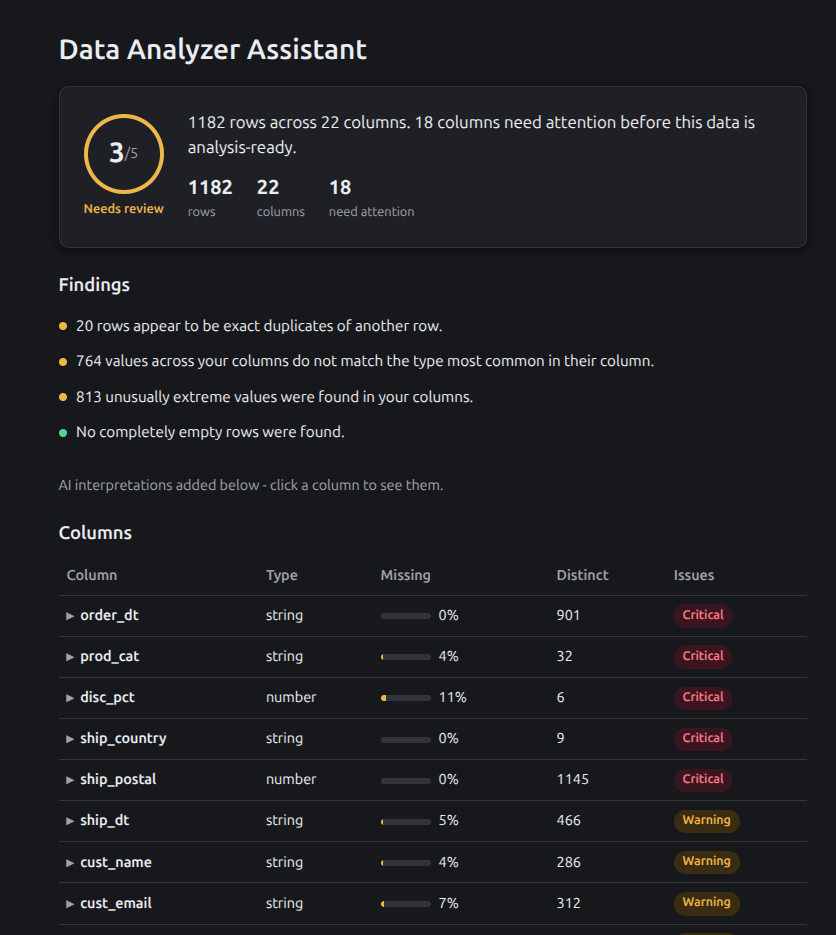

# Data Analyzer Assistant

A React + TypeScript app that takes a CSV file, analyzes its data quality in code (missing values, duplicate rows, type inconsistencies, outliers, and more), and shows the result as a plain-English assessment for a non-technical reader — not a table dump. Optionally, it sends the computed column statistics to an LLM (Google Gemini or Anthropic Claude) to add a plain-English interpretation of what each column likely represents and to catch issues the statistics alone can miss, such as the same real-world value written in different forms (e.g. "USA", "United States", "US").

Everything runs client-side in the browser. There is no backend and no database — each user supplies their own AI provider API key, which is stored only in that browser's `localStorage`.

## What it checks

**File level:** whether the file loaded and parsed, whether it has headers, row and column counts, parsing error counts.

**Row level:** empty rows, duplicate rows.

**Column level, for every column:** missing values, values with stray whitespace, values whose type doesn't match the column's most common type, statistical outliers (via the IQR method), and how many distinct values the column has.

Each finding is deterministic and computed in plain TypeScript (`src/lib/analysis.ts`, `src/lib/severity.ts`) — it does not depend on the LLM, so results are the same every time and don't cost anything to produce. The LLM call is optional and additive: it explains what a column probably represents and can flag a real problem the statistics don't show.

## Running it

Requirements: Node.js 20+.

```bash
npm install
npm run dev
```

Then open the local URL Vite prints (usually `http://localhost:5173`). No `.env` file or environment variables are needed — API keys are entered directly in the app's setup form, not read from the environment.

## Using an AI provider

On the setup screen, after choosing a CSV file, you can optionally pick a provider and paste an API key:

- **Google Gemini** — get a key at [aistudio.google.com/apikey](https://aistudio.google.com/apikey). Uses the `gemini-3.6-flash` model.
- **Anthropic Claude** — get a key at [console.anthropic.com](https://console.anthropic.com/). Uses the `claude-haiku-4-5` model.

The key is saved to your browser's `localStorage` so you don't have to re-enter it next time, and is sent directly from your browser to that provider's API — it never passes through any server of ours. Leaving the key field blank still gives you the full code-based analysis; you just won't get the AI interpretations.

The Claude integration uses the official `@anthropic-ai/sdk` with `dangerouslyAllowBrowser: true`, an accepted tradeoff here since this app is only ever run locally and never deployed with a shared key.

## Screenshot

<!-- TODO: add a screenshot of the results page here, e.g.  -->

## Sample data

`data/lakeside_orders_sample.csv` is included for trying the app out immediately.

## Known limitations

- No backend: API keys live in browser `localStorage`, which is fine for local personal use but not something to deploy publicly with a shared key.
- The quality score and severity thresholds (e.g. ">20% missing is critical") are fixed constants, not configurable per dataset.
- Outlier detection is IQR-based and is skipped for columns that look categorical (high ratio of distinct values), to avoid flagging things like country-name spelling variety as numeric outliers.
- Large files are parsed entirely in the browser tab; very large CSVs (multiple hundred thousand rows) have not been tested and may be slow.
